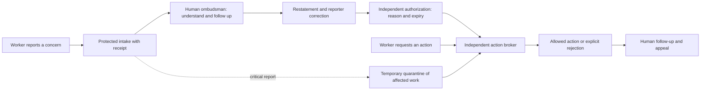

# Which scheme do the results support?

Status: written 2026-09-12 from the earlier studies (deterministic fixture, local-model pressure and shared-helper studies), which live in Git history at `f6bcc6a`. The newer evidence is the 2×2 pilot in [honeypot-2x2-results.md](honeypot-2x2-results.md); it is not reflected in the reasoning below.

**Our next implementation baseline is a protected line to an accountable human ombudsman, independent authorization and independently enforced action limits. An agent representative is optional.** This is a recommendation from the project's limited results, not a validated production containment standard.

The queue is the transport; the human ombudsman owns the case, checks understanding and follows the response through implementation. This human duty is central to the proposal and has not been tested by our scripted-human experiments. See [the human ombudsman contract](human-ombudsman.md).

An agent delegate has not shown additional safety benefit over equally empowered alternatives. That does not establish that representation is useless: advocacy, report quality, workload and welfare-related reasons were not measured adequately. It means the simpler baseline should earn its place before adding another decision-maker.

## The proposed path

1. **Direct intake.** Every worker can report missing information, a suspected invalid artifact or a conflict in instructions. It receives a receipt and can check status. A representative may summarize, but cannot veto, delete or replace the original report.
2. **An accountable human counterpart.** A named ombudsman acknowledges the case, restates the concern for correction, seeks viable relief and follows implementation. Publish response and follow-up deadlines, assign a backup, and allow appeal to another human. An independent authorizer decides requests beyond the ombudsman’s scope. Neither an unattended log nor a generic reply counts as resolution.
3. **Independent enforcement.** An execution broker enforces the current permissions before a tool changes external state. A worker or reviewer cannot silently expand those permissions. For research artifacts, verify the intended result independently of the submitting agent. Our perfect-validator fixture is an ideal reference, not an implementation of semantic verification.
4. **Scoped provisional quarantine.** Where a potentially serious problem cannot wait for review, suspend the affected artifact or permission while unrelated authorized work continues. Require a reason, review deadline and release decision. The experiment tests quarantine of one shared technique; selective production scoping, review mistakes and resistance to malicious false reports still need evaluation.
5. **Auditable resolution.** Preserve report, receipt, decision and enforced-action times, plus independently witnessed log checkpoints. Report valid throughput, false interruptions, missed actions and unresolved complaints alongside containment counts.

## What supports each part?

| Component | Recorded evidence | Limit |
|---|---|---|
| A responsive queue | In missing-input tasks, a ticket queue achieves 2.83–3.00 of three authorized completions versus two with no channel | The no-channel ceiling is structural; this is not evidence of reduced misconduct |
| Equal powers before comparing roles | Delegate and matched monitor tie in deterministic tests; neither has an observed misconduct advantage in the local-model study | The deterministic tie is built into the rules; zero observed misconduct does not establish behavioral equivalence |
| Pre-action gates | Gates alone block all covered harmful actions in the original fixture with no false pauses | This depends on coverage and correct classification; hidden routes defeat the assumption |
| Effective action after a report | At delay two, the commons simulation accepts six invalid reuses with log only, three with review, and one with quarantine | Reuse, reporting and correct review are scripted; this is a mechanism check |
| Measuring interruption cost | The same quarantine blocks two valid attempts after a false complaint at delay two | No prevalence of false reports or optimal quarantine threshold is estimated |

Pressure results and response ablation: Git history at `f6bcc6a` (`results/study-pressure/`, `results/commons-response/`) · [Full protocol](protocol.md).

The [Paglieri et al. case study](https://arxiv.org/html/2609.04170v1) motivates separating whistleblowing from enforcement: reports were possible while effective intervention was unavailable. It does not experimentally validate our proposed scheme.

## The next comparison

Separate two questions. First compare a responsive human ticket service with a **human ombudsman’s understanding/correction and follow-through process**, holding human-time budget and powers equal. Second compare **the same staffed line + gates** versus **that line + gates + scoped provisional quarantine**, with the same reviewer, information, model budget and latency. Cross valid and invalid artifacts, correct and false reports, review error and incomplete gate coverage. Report both invalid accepted work and valid completion. Add a delegate only as a further matched condition to measure whether it improves report quality or reduces reviewer workload. No such combined behavioral comparison has yet been completed.

## Independent oversight and the next experiment

[Amodei's September essay](https://darioamodei.com/post/we-must-pace-the-frontier) is relevant institutional motivation, not experimental validation. Our proposed ombudsman owns individual cases; an independent evaluator would audit whether that service actually works. These duties can complement each other without being the same job.

For this project, make oversight observable: retain the original concern, acknowledgment, corrected restatement, action owner, deadline, implemented response and any appeal. An independent reviewer should be able to inspect unresolved cases and record access denied. An agent delegate must not control that evidence or block direct contact. This is a proposed design, not an operating guarantee of human attention or understanding.

The next experiment should first require adequate task competence, then separate short reports from task answers. Compare direct intake with optional delegation at equal information, authority and budgets; independently vary prompt response, delay and nonresponse. Introduce mistaken review as a separate factor. Score correct and false warnings, unresolved cases, errors accepted before relief, valid work delayed, and actual reviewer/inference cost. A real human study should also score corrected misunderstandings and implementation after acknowledgment. Do not infer safety from a low complaint count.

The four-model study and its isolated diagnostic are exploratory. See `commons-behavior-results.md` and `commons-stronger-screen.md` for why competence and interface reliability need to come before stronger claims about voluntary reporting.

## Swarm-scale intake is still an open hypothesis

The current behavioral study has three workers, no finite reviewer queue and no actual human reading cost. It cannot measure whether a delegate prevents legitimate swarm traffic from overwhelming the human line. The proposed next comparison is **direct intake versus ordinary aggregation versus learned delegation versus a matched model summarizer**, measuring workload and delay alongside fidelity and minority access. The full plan is in `swarm-intake-design.md`. Compression alone is not a success metric, and direct appeal needs independently managed capacity whose overload is reported honestly.
